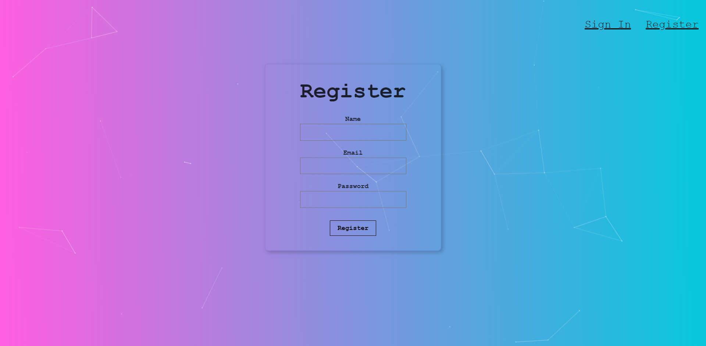

<div align="center">
  
</div>
<h1 align="center">
  SmartFace-Rekognition
</h1>
<p align="center">
  Full Stack Face Recognition WebApp built using React, Node, Clarifai API and hash secured Postgres database.
</p>
<div align="center">
  
</div>

# 📚 Libraries Used

```bash
React
Tachyons
Clarifai
Paricles
npm
Babel
```

## 🛠 Installation & Set Up

You have to set up both frontend and <a href="https://github.com/Abhishekjindal09/SmartFace_Rekognition-Backend" target="_blank">backend</a> server.

1. Clone the frontend repository.

   ```bash
   git clone https://github.com/Abhishekjindal09/SmartFace_Rekognition-Backend.git
   ```

2. Install dependencies

   ```bash
   npm install
   ```

3. Start the development server

   ```bash
   npm start
   ```
